# Getting Started

> **Note**: Make sure you have completed the [Set Up Your Environment](https://reactnative.dev/docs/set-up-your-environment) guide before proceeding.

## How to run the app

Redirect to project folder, using terminal:
```sh
cd hoor-happiest
```

For android, to add environment variables run the following commands:
```sh
export ANDROID_HOME=$HOME/Library/Android/sdk
export PATH=$ANDROID_HOME/emulator:$ANDROID_HOME/tools:$ANDROID_HOME/tools/bin:$ANDROID_HOME/platform-tools:$PATH
```
```sh
source ~/.zshrc
```

For iOS:
Open project in XCode, click on the project -> signing & Capabilities, Under signing select a team.

For Android and IOS make sure to run this command (to install node modules) inside the project root folder:
```sh
npm install
```

To run the app, make sure your android emulator/ios simulator is open or physical device is connected with usb cable the run the following command:
```sh
# for android
cd hoor-happiest
npx react-native run-android

# ios, in project root folder
cd hoor-happiest
cd ios
pod install
cd ..
npx react-native run-ios
```


## Functionalities

- Splash screen : 
Implemented **Firebase storage** call to fetch language list with locale. Language list is **saved locally using react-native-sqlite-storage**

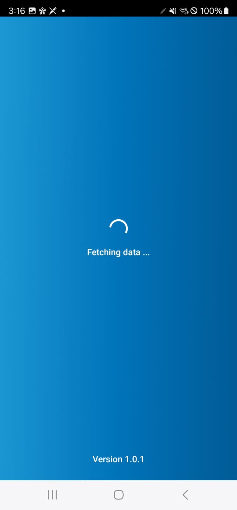

----------------------------------------------------------------------------------

- Login screen : 
Validation with state handling, You can enter any username and password, **mock data** is used.

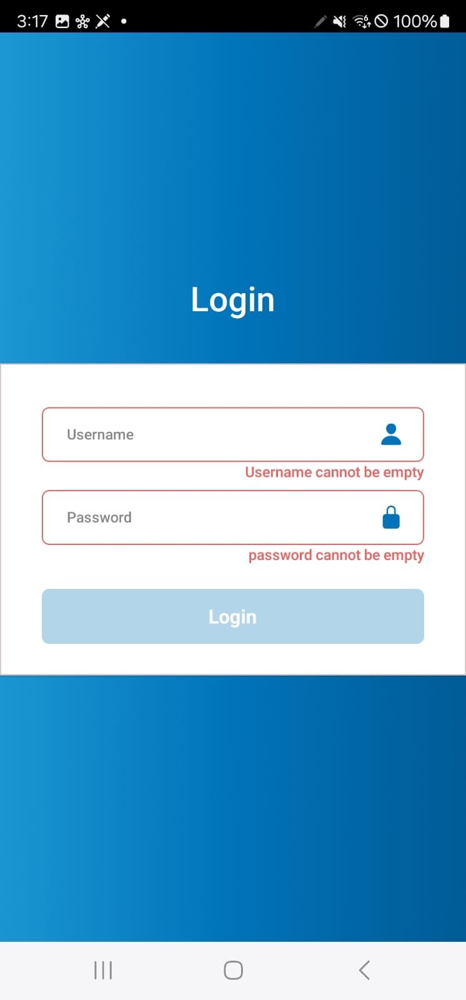

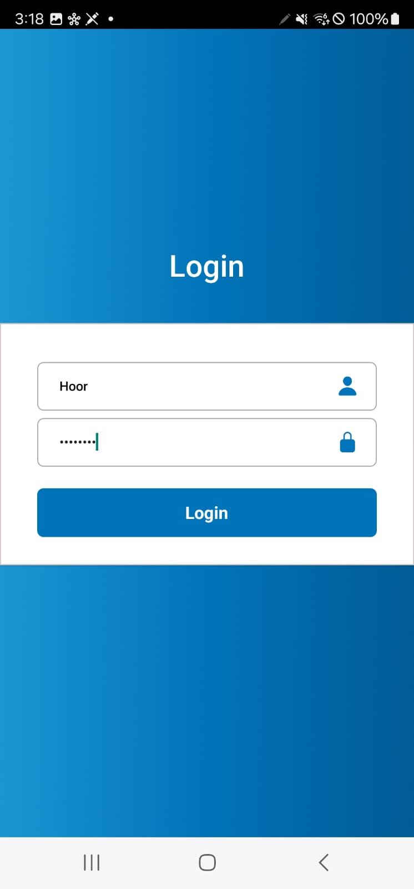

----------------------------------------------------------------------------------

- Home screen : 
**List of Events api call**, search, **add/remove favourite events** (added to local storage).

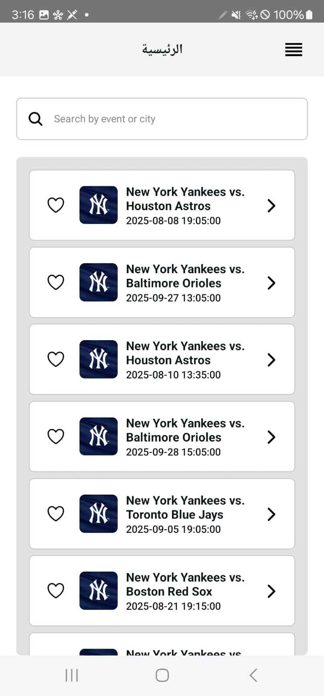

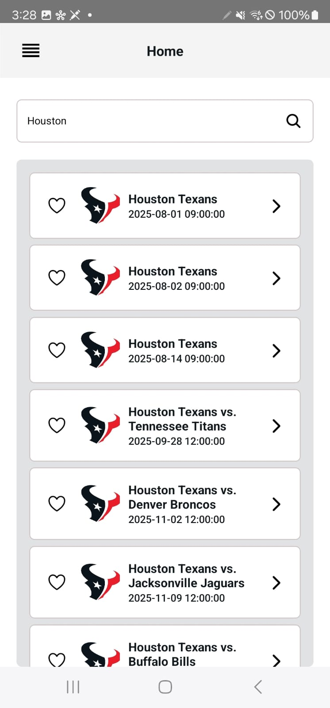

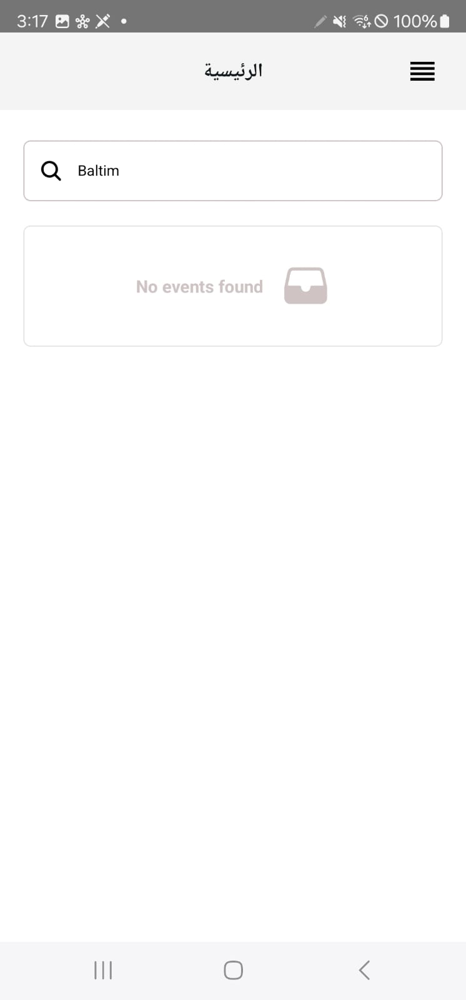

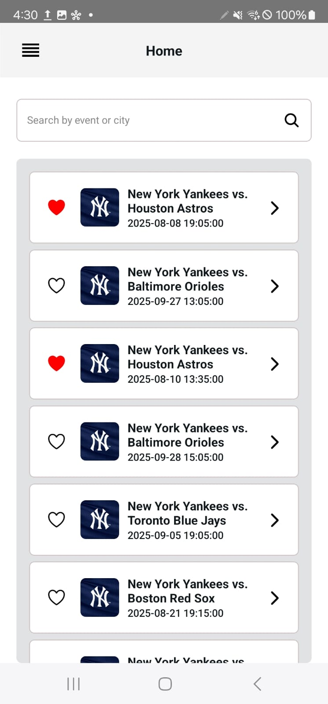

----------------------------------------------------------------------------------

- Event Details screen:
Call **details api** in home screen and pass response to Details screen.

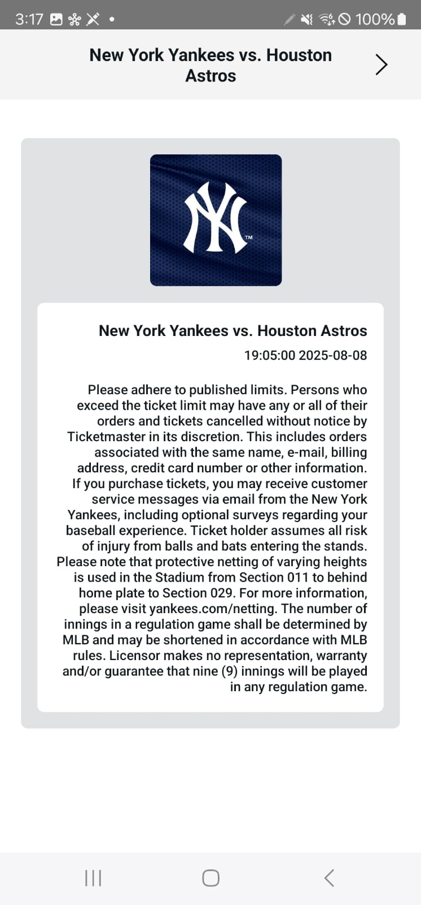

----------------------------------------------------------------------------------

- Profile screen : 
Data saved in login screen and **loaded from local storage**.

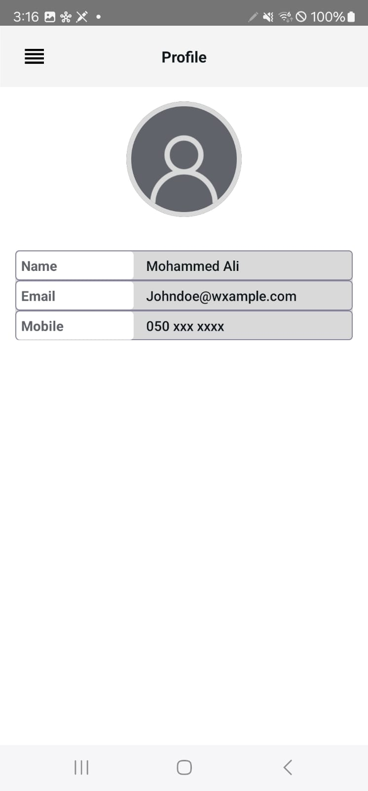

----------------------------------------------------------------------------------

- Select Language :
Languages loaded from loacl storage, on selection **set app language and locale (RTL/LTR)**.  

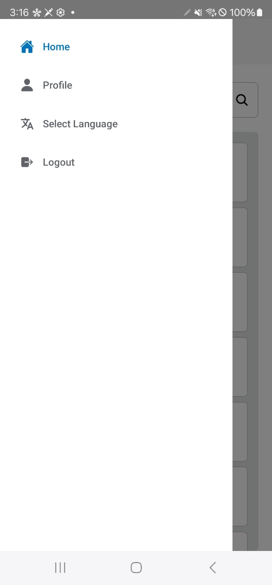

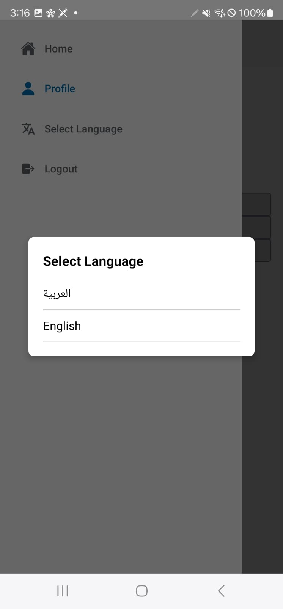

----------------------------------------------------------------------------------

- Logout :
Clear user data and preferences and redirect to login screen.  

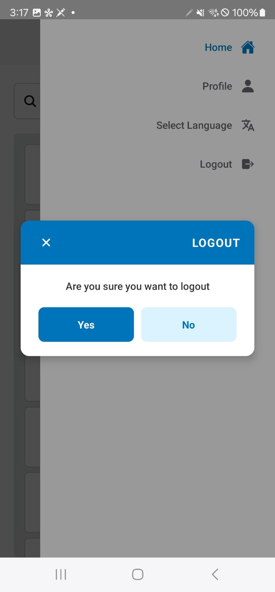